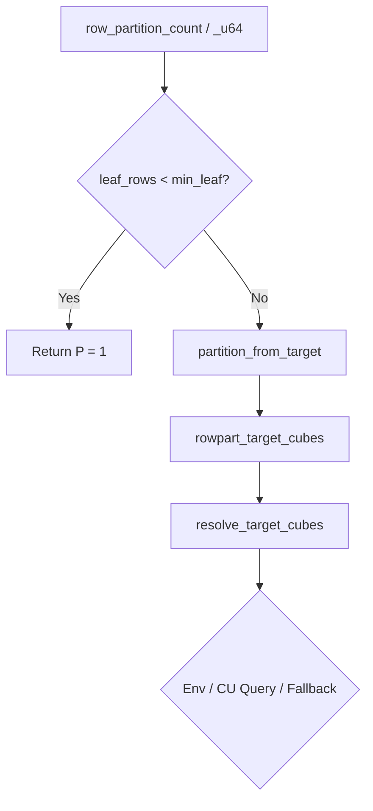

# Technical Manual: CubeCL Row Partitioning & Cubes-Per-CU Logic

This document details the design, hardware rationale, mathematical formulations, and implementation details of the **Cubes-Per-CU (Compute Unit)** partitioning technique used within the `lightgbm_rs` GPU histogram kernels.

---

## 1. Problem Statement & Motivation

In standard GPU histogram algorithms using [CubeCL](https://cubecl.github.io/), the simplest work decomposition maps each feature column to exactly one **Cube** (equivalent to a CUDA Thread Block or a WebGPU Workgroup). 

However, this mapping suffers from a critical performance bottleneck under certain conditions:
* **GPU Underutilization**: If a dataset contains only a small number of features (e.g., 50 features) but is executed on a high-end GPU with many Compute Units (e.g., AMD gfx1100 with 96 CUs), mapping one cube per feature means launching only 50 cubes. This leaves 46 CUs completely idle, utilizing only ~52% of the GPU's compute capability.
* **Lack of Latency Hiding**: GPUs require multiple active workgroups per physical Compute Unit to hide memory and instruction latency. Having less than 1 workgroup per CU guarantees poor occupancy and severe latency-bound bottlenecks.

### The Solution: Row Partitioning
To solve this, the **Row Partitioning** technique divides the data rows of each feature into $P$ segments. Instead of launching one cube per feature, the kernel launches $P$ cubes per feature, where each cube constructs a partial local sub-histogram for its subset of rows. These partial sub-histograms are subsequently merged using atomic operations.

---

## 2. Mathematical Formulation

The partitioning factor $P$ is determined at runtime based on the queried physical hardware layout of the GPU.

### Key Terms and Constants
1. **$C_{CU}$ (Target Cubes per CU)**: 
   Defined by the constant `CUBES_PER_CU = 8`. This targets 8 workgroups scheduled per physical Compute Unit.
2. **$N_{CU}$ (Physical Compute Unit Count)**: 
   The number of physical CUs/SMs on the GPU (e.g., 8 on a Radeon 860M APU, 96 on a gfx1100).
3. **$T_{cubes}$ (Target Grid Cubes)**: 
   The total target number of cubes across the entire GPU:
   $$T_{cubes} = N_{CU} \times C_{CU}$$
4. **$N_{features}$ (Feature Count)**: 
   The number of feature columns in the training dataset.
5. **$P$ (Partitions per Feature)**: 
   The final row partitioning factor.

### The Partitions Formula
If $N_{features} \ge T_{cubes}$, the GPU is already fully saturated by features, so no partitioning is needed ($P = 1$). 

Otherwise, $P$ is calculated as follows:
$$P = \text{clamp}\left( \left\lfloor \frac{T_{cubes}}{N_{features}} \right\rfloor, 1, P_{\max} \right)$$
Where $P_{\max} = 16$ is the maximum partition limit to avoid atomic contention bottlenecks.

---

## 3. Heuristic Implementation Details

The implementation resides in [histogram.rs](file:///home/user/Documents/workspace/lightgbm_rs/crates/lgbm-compute/src/kernels/histogram.rs) and consists of the following components:

### A. Gating by Leaf Size
Dividing rows and performing atomic merges introduces overhead. Thus, partitioning is only enabled if a leaf has a sufficient number of rows:
* **f32 (floating-point) kernels**: Gated at `ROWPART_MIN_LEAF = 256,000` rows.
* **u64 (fixed-point) kernels**: Gated at `ROWPART_MIN_LEAF_U64 = 20,000` rows. 

The fixed-point (integer) build is order-independent (immune to floating-point summation drift), meaning we can safely partition smaller leaves (down to 20k rows) to boost occupancy.

### B. Functions Architecture

1. **`query_num_cu() -> Option<u32>`**:
   Queries the active GPU client's hardware properties. If CubeCL properties are unpopulated, it performs a fallback FFI query to the HIP/ROCm driver (`hipGetDevicePropertiesR0600`).
2. **`resolve_target_cubes(env_override: Option<u32>, queried_cu: Option<u32>) -> u32`**:
   Pure, unit-testable function mapping inputs to the grid target:
   - Env override `LGBM_ROWPART_TARGET_CUBES` (wins verbatim if $>0$).
   - Otherwise, `queried_cu * CUBES_PER_CU`.
   - Otherwise, falls back to `ROWPART_TARGET_CUBES_FALLBACK` (`64` cubes, representing a standard 8-CU APU).
3. **`rowpart_target_cubes() -> u32`**:
   Caches the resolved target cubes count in a `OnceLock` to prevent repeated driver FFI queries.
4. **`partition_from_target(num_features: usize, target: u32) -> u32`**:
   Applies the clamped division formula: `(target / num_features).clamp(1, ROWPART_P_MAX)`.

---

## 4. Configuration Controls

Developers can control and tune this behavior using environment variables:

| Environment Variable | Type | Default | Description |
|---|---|---|---|
| `LGBM_ROWPART_TARGET_CUBES` | `u32` | None (derived) | Direct target grid size override (skips multiplication by `CUBES_PER_CU`). |
| `LGBM_ROWPART_MIN` | `usize` | `256_000` (f32) / `20_000` (u64) | Leaf-row threshold override to force row-partitioning on smaller leaves. |
| `LGBM_AUTOTUNE` | `bool` | `true` | Enables active autotuning which can dynamically refine $P$ beyond the heuristic default. |
